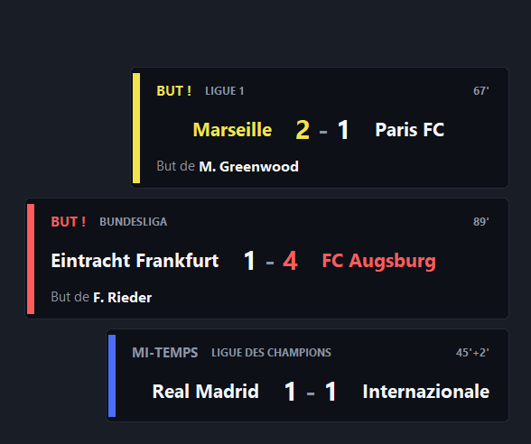

# butbutbut

[](https://github.com/boubou666/butbutbut/actions/workflows/ci.yml)
[](https://github.com/boubou666/butbutbut/releases)
[](https://www.python.org/)
[](LICENSE)

Un but tombe en **Ligue 1**, **Premier League**, **LaLiga**, **Serie A** ou
**Bundesliga** : le son part, et une carte s'affiche en bas a droite de ton
ecran avec le score et le buteur.



L'equipe qui vient de marquer et son chiffre sont dans la couleur du
championnat, le nom du buteur ressort en clair. Deux buts en meme temps ne se
marchent pas dessus : les cartes s'empilent depuis le coin. Les temps forts du
match (coup d'envoi, mi-temps, reprise, fin) ont droit a une carte plus
discrete, sans son : c'est la troisieme ci-dessus.

Comme [doot](https://github.com/boubou666/doot) : **zero dependance**, rien que
la bibliotheque standard de Python, et ca tourne sur Windows, macOS et Linux.

---

## Installation

### Linux (Arch, Debian/Ubuntu, Fedora, openSUSE...) et macOS

```bash
git clone https://github.com/boubou666/butbutbut
cd butbutbut
./install.sh
```

Options : `--no-autostart`, `--leagues l1,pl`, `--position top-right`,
`--interval 25`.

Le script installe la commande dans `~/.local/bin`, puis active le demarrage
automatique a l'ouverture de session : unite **systemd utilisateur** sous
Linux, **LaunchAgent** sous macOS, `.desktop` d'autostart en dernier recours.

### Windows 10/11

```powershell
powershell -ExecutionPolicy Bypass -File .\install.ps1
```

Options : `-NoAutostart`, `-Leagues "l1,pl"`, `-Position top-right`,
`-Interval 25`. Pas besoin de droits admin : tout va dans
`%LOCALAPPDATA%\Programs\butbutbut` et un raccourci est pose dans le dossier
Demarrage.

### Arch Linux (paquet natif)

```bash
cd packaging && makepkg -si
systemctl --user enable --now butbutbut.service
```

### Sans rien installer

```bash
python -m butbutbut --test 3
```

---

## Utilisation

```bash
butbutbut                     # surveille en fond (comportement par defaut)
butbutbut --test              # une carte de demonstration
butbutbut --test 3            # trois cartes, pour voir l'empilement
butbutbut --scores            # les matchs du jour dans le terminal
butbutbut --list              # les competitions surveillables
butbutbut --status            # daemon, son, ecrans, connexion a la source
butbutbut --stop              # arrete le daemon
butbutbut --paths             # ou vivent les donnees et le journal
butbutbut --screens           # les ecrans detectes
```

La commande s'appelle aussi `but`, en plus court.

### Choisir les competitions

Par defaut : les cinq grands championnats. `--leagues` en choisit,
`--exclude` en retire :

```bash
butbutbut --leagues l1,pl                 # seulement ces deux-la
butbutbut --exclude liga,seriea           # les 5 grands moins deux
butbutbut --leagues l1,ligue2,ucl,cdf     # Ligue 1 + Ligue 2 + C1 + Coupe de France
butbutbut --leagues all                   # tout le catalogue
butbutbut --leagues big5                  # les 5 grands, explicitement
```

Le catalogue va bien au-dela des cinq grands : **36 competitions** verifiees
contre la source, dont

| Famille | Exemples (noms acceptes) |
| --- | --- |
| Coupes d'Europe | `ucl`/`c1`, `uel`/`europa`, `uecl`/`conference`, `supercoupe` |
| Selections | `cdm`/`mondial`, `nations`, `qualifs` |
| 2es divisions | `ligue2`/`l2`, `championship`, `serieb`, `bundesliga2`, `liga2` |
| Europe | `portugal`, `eredivisie`, `belgique`, `superlig`, `ecosse` |
| Coupes nationales | `cdf`/`coupedefrance`, `facup`, `carabao`, `copa`, `coppa`, `dfb` |
| Hors d'Europe | `mls`, `ligamx`, `bresil`, `argentine`, `saudi`, `jleague`, `libertadores` |

`butbutbut --list` affiche le catalogue complet avec les alias.

**Et une competition qui n'y est pas ?** Passe directement son code ESPN, il
sera suivi quand meme :

```bash
butbutbut --leagues gre.1        # Greek Super League
butbutbut --leagues aus.1,den.1  # A-League, Superliga danoise
```

Le nom affiche sur la carte est alors celui que la source annonce, recupere au
premier releve (`gre.1` devient « GREEK SUPER LEAGUE »).

> Attention quand meme : `--leagues all`, c'est 36 endpoints a interroger. La
> cadence adaptative fait le gros du travail (une competition sans match est
> relue toutes les 5 minutes seulement), mais reste raisonnable.

### Placer les cartes

```bash
butbutbut --position bottom-right     # defaut
butbutbut --position top-left
butbutbut --screen 1                  # sur le second ecran
butbutbut --scale 1.4                 # cartes plus grandes
butbutbut --opacity 0.9
```

Les cartes s'empilent depuis le coin choisi : la derniere arrivee est collee au
coin, les precedentes remontent (ou descendent, depuis un coin du haut). Au-dela
de cinq cartes visibles, la plus ancienne cede sa place.

### Le son

Le mp3 fourni est joue a chaque but. Pour le remplacer, depose un fichier dans
le dossier `sound` (`butbutbut --paths` donne le chemin) :

| Systeme | Dossier |
| --- | --- |
| Windows | `%LOCALAPPDATA%\butbutbut\sound` |
| macOS | `~/Library/Application Support/butbutbut/sound` |
| Linux | `~/.local/share/butbutbut/sound` |

Formats : wav, mp3, ogg, opus, flac, m4a, aac. Plusieurs fichiers ? Le tirage
est au hasard a chaque but. Pas besoin de redemarrer le daemon : le dossier est
relu a chaque fois.

```bash
butbutbut --no-sound          # muet
butbutbut --no-overlay        # juste le son et le journal, pas de carte
butbutbut --duration 8        # garder la carte 8 s (defaut : la duree du son)
```

### Les temps forts du match

En plus des buts, une carte signale le **coup d'envoi**, la **mi-temps**, la
**reprise** et la **fin du match**. Elles sont volontairement plus sobres : le
titre est gris au lieu de la couleur du championnat, il n'y a pas de troisieme
ligne, aucune equipe n'est mise en avant, et surtout **elles ne font aucun
bruit**. Seul un but declenche le son.

```bash
butbutbut --no-phase-cards    # seulement les buts a l'ecran
```

Le journal, lui, garde la trace de ces moments meme avec cette option.

Sur Windows et macOS la lecture est integree (MCI, `afplay`). Sous Linux il faut
un lecteur : `mpv` ou `ffmpeg` pour le mp3 ; avec seulement `aplay`/`paplay`,
butbutbut retombe sur une **corne de stade synthetisee** en wav, generee par le
programme lui-meme.

---

## D'ou viennent les scores

**Une seule source, la meme pour toutes les competitions** : le tableau de bord
public d'ESPN, un endpoint par competition.

```
https://site.api.espn.com/apis/site/v2/sports/soccer/<code>/scoreboard
```

| Championnat | Code |
| --- | --- |
| Ligue 1 | `fra.1` |
| Premier League | `eng.1` |
| LaLiga | `esp.1` |
| Serie A | `ita.1` |
| Bundesliga | `ger.1` |

C'est aussi ce qui rend le catalogue extensible : Ligue 2 c'est `fra.2`, la
Ligue des champions `uefa.champions`, la Coupe de France
`fra.coupe_de_france`... meme format de reponse, meme code de lecture.

Pourquoi cette source : pas de cle d'API, pas d'inscription, pas de quota a
surveiller, elle est mise a jour en direct, et elle donne le **buteur**, la
**minute**, les **csc** et les **penaltys**. C'est une API publique mais non
documentee : tout est lu de facon defensive, une cle qui disparait ne tue pas
le daemon.

### Comment un but est detecte

A chaque releve, le score de chaque match est compare a celui du releve
precedent. **Un score qui monte, c'est un but.** La liste des actions d'ESPN ne
sert qu'a habiller la carte (buteur, minute, csc, penalty) : elle arrive parfois
quelques secondes apres le score, et le but ne doit pas attendre le nom du
buteur.

Deux garde-fous :

- **le premier releve ne declenche rien.** Il photographie l'existant. Sinon,
  lancer le daemon un dimanche a 17 h rejouerait tous les buts deja marques ;
- **un score qui descend** (but refuse par la VAR) affiche une carte orange
  `BUT ANNULE`, sans son.

### Cadence

Chaque championnat a son propre rythme, pour ne pas marteler la source :

| Situation | Releve |
| --- | --- |
| un match en cours | toutes les 25 s (`--interval`) |
| coup d'envoi dans moins de 20 min | toutes les 60 s |
| rien au programme | toutes les 5 min (`--idle-interval`) |

Un mardi soir sans Bundesliga, la Bundesliga est interrogee toutes les cinq
minutes. En cas de coupure reseau, l'attente double a chaque echec (plafond
5 min) et la reprise est notee dans le journal.

---

## Ce qui se passe a l'ecran

- **fenetre sans bordure, toujours au-dessus**, qui ne vole jamais le focus ;
- **Windows** : fond reellement transparent (coins arrondis) et fenetre
  *click-through* : les clics passent au travers, tu peux continuer a jouer ;
- **macOS** : fenetre sans bordure, absente du Dock ;
- **Linux** : fenetre de type *splash*, posee au-dessus ;
- **multi-ecrans** : les ecrans sont enumeres via l'API systeme
  (`EnumDisplayMonitors`, `xrandr --listmonitors`, CoreGraphics), pas via
  tkinter, pour qu'une carte ne se retrouve jamais a cheval sur deux dalles.

L'affichage vit dans le fil principal (tkinter y tient), la surveillance reseau
dans un fil a part : une requete lente ne fige jamais une carte a l'ecran.

---

## Journal

```
2026-09-06 18:41:21  demarrage (pid 3752) - les 5 championnats - releve toutes les 25s en direct, 300s au repos
2026-09-06 18:41:21  15 match(s) au programme, 6 en cours, 3 a venir
2026-09-06 18:43:27  BUT [Premier League] Arsenal 2 - 1 Chelsea pour Arsenal - But de M. Odegaard (50')
```

Chemin : `butbutbut --paths`. Le daemon ecrit aussi les coups d'envoi et les
fins de match.

---

## Prerequis

- **Python 3.8+**
- **tkinter** (paquet systeme sous Linux : `tk`, `python3-tk`,
  `python3-tkinter` selon la distribution ; `brew install python-tk` sous macOS)
- **un lecteur audio** sous Linux uniquement (`mpv`, `ffmpeg`, `sox`, `vlc`,
  ou pipewire/pulse/alsa pour le repli wav)
- une connexion internet

`butbutbut --status` verifie tout ca d'un coup, connexion a la source comprise.

---

## Desinstallation

```bash
./uninstall.sh              # ou --purge pour effacer aussi tes sons perso
```

```powershell
powershell -ExecutionPolicy Bypass -File .\uninstall.ps1    # ou -Purge
```

---

## Tests

```bash
PYTHONPATH=".:tests" python -m unittest discover -s tests
```

**145 tests**, sans reseau ni ecran : la source est simulee par un `opener`, et
la geometrie des cartes (empilement, debordement, troncature) est verifiee avec
une police factice, donc sans tkinter.

---

## Versions

Les evolutions sont consignees dans [CHANGELOG.md](CHANGELOG.md), au format
[Keep a Changelog](https://keepachangelog.com/fr/1.1.0/). Chaque version porte
un tag `vX.Y.Z` et une
[release](https://github.com/boubou666/butbutbut/releases) construite
automatiquement, avec le paquet en piece jointe.

## Licence

MIT.
